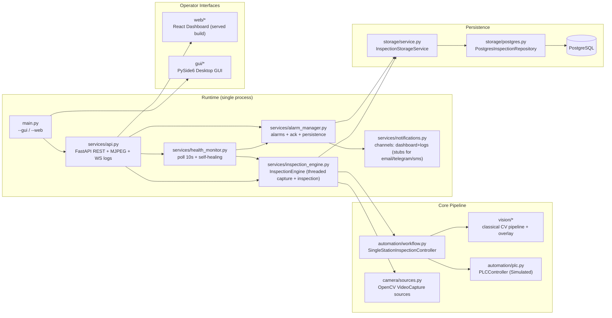
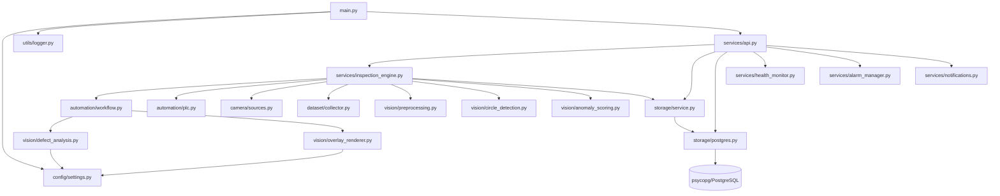
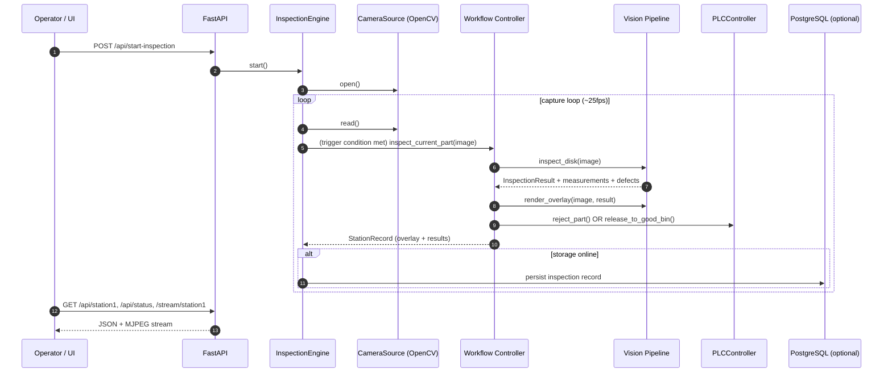
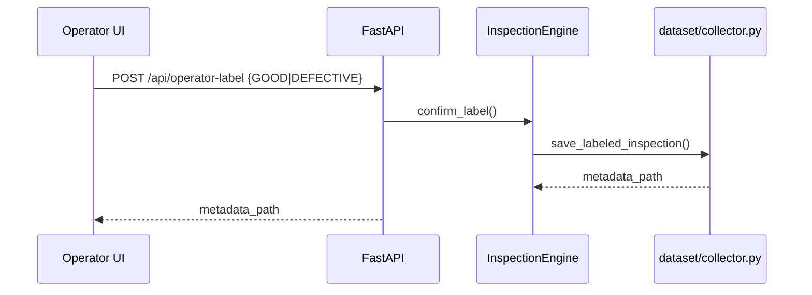

# DiskVisionInspector - Project Analysis (Phase 1)

Date: 2026-05-31

This document describes the *current* DiskVisionInspector codebase as it exists today (before any Phase 2+ refactor). It inventories structure, runtime behavior, dependencies, and gaps against an industrial 24/7 appliance target.

## Folder Structure (Current)

Top-level directories (high signal):

```text
automation/   PLC boundary + single-station workflow state machine
camera/       Camera source abstractions (USB/video/RTSP) + simulator contract
config/       JSON config (tolerances, health thresholds) + env/paths
dataset/      Labeling + dataset capture/export utilities
database/     SQL migrations + schema helpers
gui/          PySide6 desktop GUI (local HMI)
services/     InspectionEngine + FastAPI API + health/alarms/notifications
storage/      PostgreSQL repository + storage service façade
utils/        Logging + file/image helpers
vision/       Classical CV inspection pipeline + overlay rendering
web/          React/Vite dashboard (served via FastAPI from web/dist)
outputs/      Runtime outputs (logs, images) (mounted in docker-compose)
tests/        Pytest suite (core workflows + API contract)
```

## Entry Points and Startup

- `main.py`
  - `--gui`: runs the PySide6 desktop app.
  - `--web` / `--headless`: runs FastAPI + serves React build (`web/dist`) over LAN.
  - Web build behavior: `_ensure_web_dashboard_built()` builds `web/dist` when missing or stale (and supports forcing via env).
- `services/api.py`
  - `create_app()` defines all REST endpoints + websocket logs.
  - Creates `InspectionEngine`, health monitor, alarm manager, notification dispatcher.
  - Starts health monitoring on FastAPI startup and stops on shutdown.

## Current Architecture Diagram



Key observation: the system is currently a *single Python process* in web mode (and a different single Python process in GUI mode). The internal components behave like services but are not independently deployable/restartable yet.

## Dependency Graph (Python Modules)

The import graph below reflects *code-level* dependencies (not OS/network).



Notes:
- `gui/*` also imports many of the same modules directly (workflow, storage, vision, tolerances). In GUI mode, the desktop app is not a thin client; it is an alternative composition.
- `web/*` is a separate TypeScript build that calls REST endpoints and a websocket endpoint.

## Data Flow Diagram (Inspection Cycle)



### Dataset label flow (DATA_COLLECTION mode)



## Camera Subsystem (Current)

What exists now:
- `camera/sources.py`
  - `OpenCVCameraSource` (wraps `cv2.VideoCapture`)
  - `UsbCameraSource`, `VideoFileSource`, `RtspCameraSource`
  - `IndustrialCameraSource` is a placeholder boundary.
- `camera/industrial_camera.py` + `camera/camera_simulator.py`
  - An abstract `IndustrialCamera` contract for future SDK integrations.
  - A folder-backed simulator (cycles images).

Current limitations for industrial use:
- No explicit camera state model (ONLINE/OFFLINE/RECONNECTING/ERROR) at the source layer.
- No timeouts on read beyond OpenCV behavior.
- No per-camera metrics in a structured form (FPS, drops, open failures) at the camera layer; these are partially estimated at the engine layer.

## AI / Inference Pipeline (Current)

Despite the name “AI”, the present pipeline is deterministic classical CV:
- `vision/defect_analysis.py` orchestrates:
  - preprocessing + foreground mask
  - outer circle detection
  - hole detection + geometry checks
  - surface defect detection
  - decision aggregation + measurement dict
- `vision/anomaly_scoring.py` provides heuristic “anomaly score” and “assisted prediction”

Current limitations:
- No model management, versions, confidence calibration, or GPU acceleration hooks.
- Timing instrumentation exists (cycle time) but is not decomposed into per-stage timings.

## Web Dashboard (Current)

UI stack:
- React + Vite (`web/`)
- Poll-based snapshot (`useSnapshot.ts`) at `POLL_INTERVAL_MS = 1500ms`
- WebSocket `/ws/logs` for log streaming

Pages:
- Production, Training, History, Settings, Calibration
- Added System Health page consuming `/api/system/*` endpoints

Serving model:
- FastAPI serves `web/dist/index.html` and `/assets/*` when built
- No hot reload in `--web` mode (that is provided by `npm run dev` during development)

Current limitations:
- No authentication/authorization.
- Polling is the primary mechanism for UI updates (except logs).
- No built-in multi-user session model.

## Database Layer (Current)

PostgreSQL via `psycopg`:
- `storage/postgres.py` implements:
  - inspection records (partitioned by day)
  - serial counters
  - dataset label records
  - camera calibration records
  - system alarms + system health history (added recently)

Strengths:
- Partitioning approach is suitable for high-volume inspection history.
- JSONB for measurements/defects is flexible.

Gaps:
- No retention policy enforcement for inspection records and label records yet (history retention exists for system health only).
- No integrity checks/maintenance tasks scheduled.
- No backup scheduling.

## Configuration System (Current)

- `config/settings.py` defines:
  - paths (`OUTPUT_DIR`, `LOG_DIR`, etc.)
  - API host/port env overrides
  - Postgres DSN loading (from `storage/.env` or env var)
  - tolerances JSON load/save
  - health thresholds JSON load

Strengths:
- Operator-tunable tolerances via JSON file.
- Environment overrides supported for deployment.

Gaps:
- No config validation schema (Pydantic or JSON schema).
- No layered config profiles (dev/staging/prod) beyond env vars.
- Secrets are not managed beyond `.env` conventions.

## Logging (Current)

- `utils/logger.py` sets up:
  - console logging
  - a single file handler `outputs/logs/inspection.log`

Strengths:
- Simple, always-on logging, works in both GUI and web modes.

Gaps for industrial deployment:
- No log rotation policy (single file can grow indefinitely).
- Logs are mostly unstructured strings (engine keeps an in-memory list of recent logs as strings).
- No correlation IDs / request IDs for API calls.
- No separate log streams per “service” (because services aren’t separated yet).

## Existing APIs (Current)

Core inspection:
- `/api/status`, `/api/station1`, `/api/metrics`, `/api/history`, `/api/logs`
- Start/stop/reset: `/api/start-inspection`, `/api/stop-inspection`, `/api/reset`, `/api/start-part`, etc.
- Streaming: `/stream/station1`, `/image/station1/*`
- Websocket: `/ws/logs`

Calibration:
- `/api/calibration/*`

System monitoring (added):
- `/api/system/health`
- `/api/system/devices`
- `/api/system/alarms`
- `/api/system/alarm-history`
- `/api/system/alarm/{id}/ack`
- `/api/system/history`
- `/api/system/notifications`

## Strengths

- Clear separation between deterministic vision (`vision/`) and orchestration (`automation/`, `services/`).
- Single-station workflow is easy to reason about and test.
- FastAPI-based LAN dashboard already supports headless operation.
- PostgreSQL partitioning strategy is a good base for industrial history.
- Existing automated tests cover key workflows and the API contract.
- Configuration via JSON tolerances enables shop-floor tuning without code changes.

## Weaknesses

- Not a true multi-service architecture yet: “services” are modules inside a single process.
- GUI and web modes compose the system differently (GUI imports many internals directly), which increases maintenance burden.
- No security layer (no auth, no TLS, no RBAC, no rate limiting).
- Monitoring is present but not yet “industrial hardened”:
  - no hysteresis strategy beyond dedupe
  - limited service crash supervision (no independent restarts)
  - OS-level watchdog integration absent
- Image lifecycle/retention policies are not implemented for good/reject/overlay storage.

## Technical Debt (Concrete)

- `InspectionEngine` blends:
  - camera capture loop timing
  - trigger logic
  - inspection execution
  - health metrics estimation
  - storage persistence decisions
  This will be the main pressure point for Phase 2 service separation.

- FastAPI lifecycle uses `@app.on_event` which is deprecated in FastAPI; should migrate to lifespan.

- No schema validation for JSON config; runtime failures show up only after load.

- No consistent domain models for API responses (most endpoints return raw dicts).

- Web UI uses polling for most state; websocket only for logs.

## Refactoring Opportunities (Phase 2+ Candidates)

These are presented as *opportunities*, not changes performed in Phase 1:

1. Service decomposition (target architecture in your prompt)
- Extract “camera capture + state” into `camera_service/` (separate process with a stable IPC API).
- Extract “inspection pipeline execution” into `ai_service/` (even if still classical CV initially).
- Extract DB access into `database_service/` (or keep as library but isolate failure domains).
- Add a `watchdog_service/` (process supervisor) and integrate with systemd.

2. Consistent domain models
- Define Pydantic response models for all API endpoints.
- Versioned API schemas for backward compatibility.

3. Observability hardening
- Structured logging (JSON) + rotation.
- Metrics: internal counters, histogram timings, error budgets.
- Health endpoints per component with explicit state machine.

4. Storage lifecycle
- Implement retention policies for image artifacts and DB partitions.
- Add backup/restore scripts.

5. Security baseline
- JWT auth + RBAC, CSRF protections for dashboard.
- TLS termination strategy (Caddy/Nginx) or uvicorn TLS for small deployments.
- Rate limiting + audit logs.

## Summary: What “Production-Ready Industrial Platform” Requires Next

Relative to the master prompt phases, the current project is a solid single-station prototype with a functioning LAN dashboard and a classical CV pipeline, but it lacks:
- true independent services and crash isolation,
- lifecycle management (systemd + watchdog),
- security (auth/RBAC/TLS),
- retention/backup strategy,
- robust camera + AI process supervision and metrics,
- and a unified composition model (GUI should become a client of the services).

Phase 1 ends here: analysis is complete and no refactor has been performed in this document.

